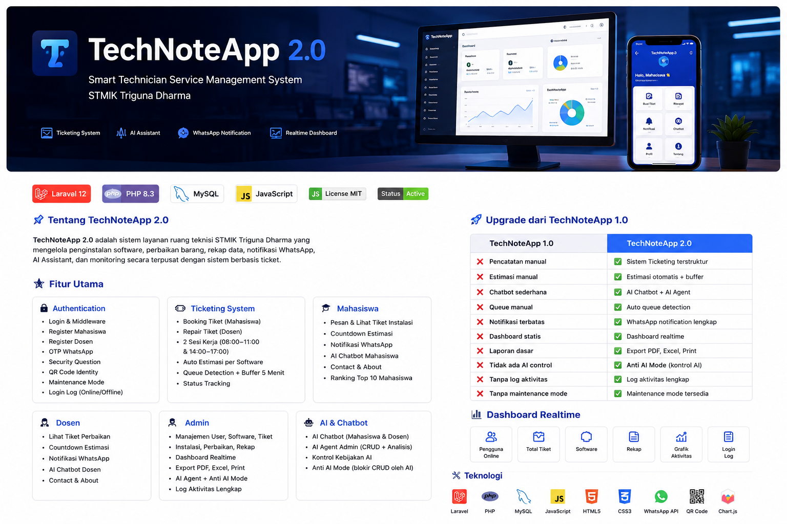

# 💻 TechNoteApp 2.0

### Smart Technician Service Management System

  Sistem layanan ruang teknisi STMIK Triguna Dharma berbasis Ticketing, AI, dan WhatsApp Notification.

  
  
  
  

---

## 🚀 Overview

TechNoteApp 2.0 merupakan pengembangan dari TechNoteApp 1.0 yang menghadirkan sistem layanan teknisi berbasis Ticketing System, AI Assistant, AI Agent, WhatsApp Notification, serta Dashboard Realtime.

---

# ✨ Features

<table>

<tr>
<td width="50%">

## 👤 Authentication

- Login
- Register Mahasiswa
- Register Dosen
- OTP WhatsApp
- Security Question
- QR Code Identity
- Maintenance Mode

</td>

<td width="50%">

## 🎫 Ticketing

- Booking Ticket
- Queue Management
- Session Booking
- Auto Estimation
- Buffer Time
- Status Tracking

</td>
</tr>

<tr>

<td>

## 🎓 Mahasiswa

- Booking Software
- My Installation
- Countdown Estimation
- WhatsApp Notification
- AI Chatbot
- Contact
- About
- Ranking

</td>

<td>

## 👨‍🏫 Dosen

- Repair Tracking
- Countdown
- WhatsApp Notification
- AI Chatbot
- Contact
- About

</td>

</tr>

<tr>

<td>

## 👨‍💼 Admin

- Dashboard
- User Management
- Software Management
- Installation
- Repair
- Ticket
- Reports
- Export PDF
- Export Excel
- Print

</td>

<td>

## 🤖 Artificial Intelligence

- AI Chatbot Mahasiswa
- AI Chatbot Dosen
- AI Agent Admin
- CRUD AI
- Data Analysis
- Anti AI Mode

</td>

</tr>

</table>

---

# 📈 Dashboard

<table>
<tr>
<td>✅ Dashboard Realtime</td>
<td>✅ Activity Log</td>
</tr>

<tr>
<td>✅ Login Monitor</td>
<td>✅ Statistics</td>
</tr>

<tr>
<td>✅ Charts</td>
<td>✅ Reports</td>
</tr>

</table>

---

# 📲 WhatsApp Integration

- OTP Login
- Forgot Password
- Installation Finished
- Repair Finished
- Failed Notification

---

# 🔒 Security

- Middleware
- Activity Log
- Login Log
- Maintenance Mode
- Anti AI Mode
- QR Code Identity

---

# 🔥 Upgrade from TechNoteApp 1.0

| TechNoteApp 1.0 | TechNoteApp 2.0 |
|-----------------|-----------------|
| Manual Installation | Ticket Booking |
| Basic CRUD | Smart Ticketing |
| Chatbot | AI Chatbot + AI Agent |
| Manual Queue | Auto Queue Detection |
| Manual Estimation | Dynamic Estimation |
| Dashboard | Dashboard Realtime |
| WhatsApp Notification | Advanced WhatsApp Integration |
| Basic Report | Smart Report |
| No AI Control | Anti AI Mode |

---

# 🛠 Technology

---

## TechNoteApp 2.0

Smart Technician Service Management System

Made with ❤️ using Laravel

